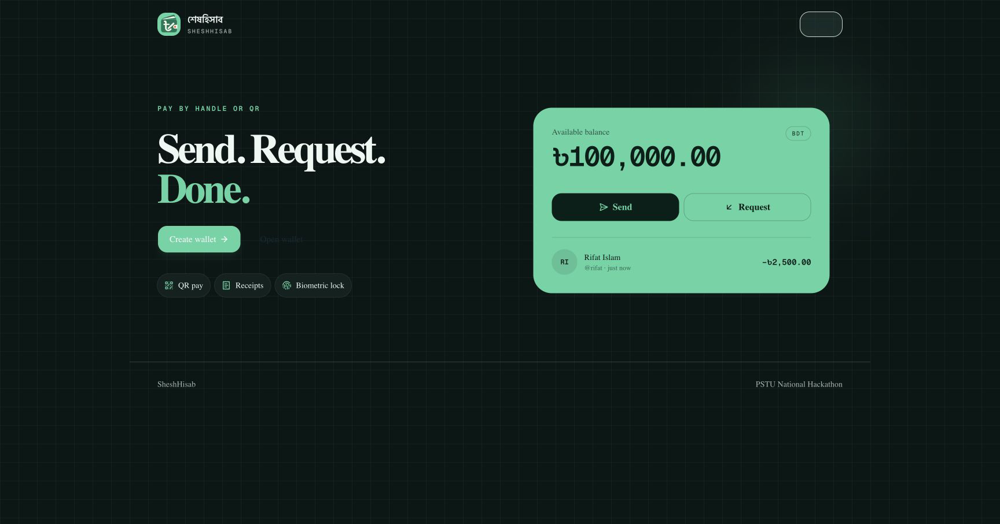
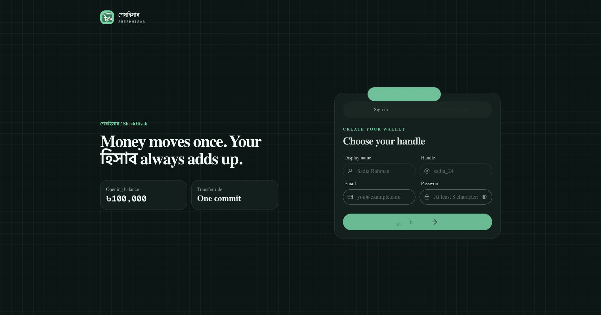
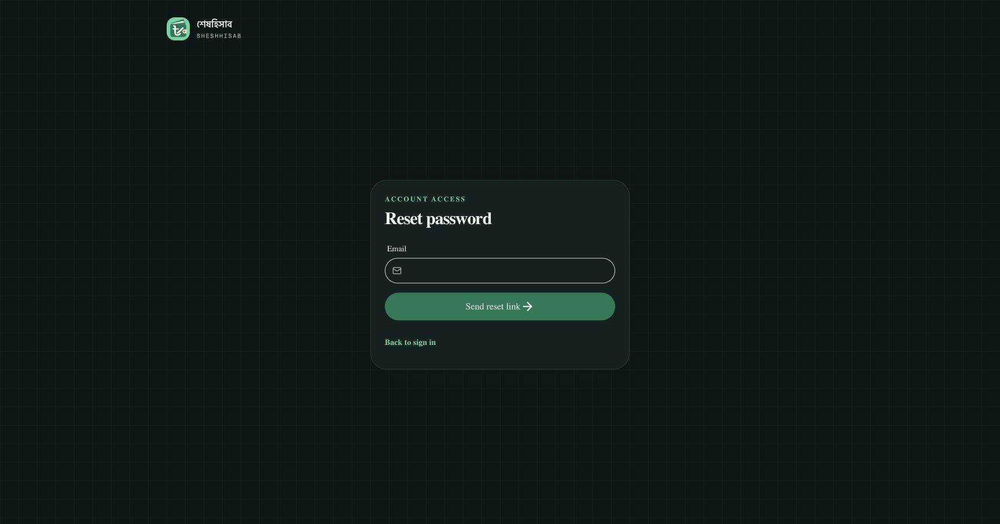
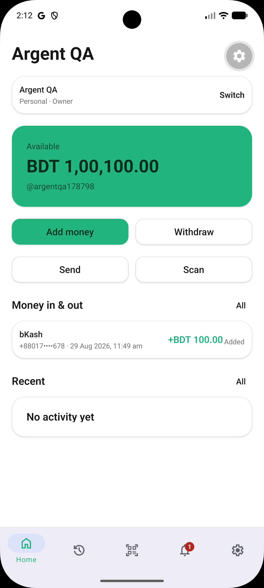
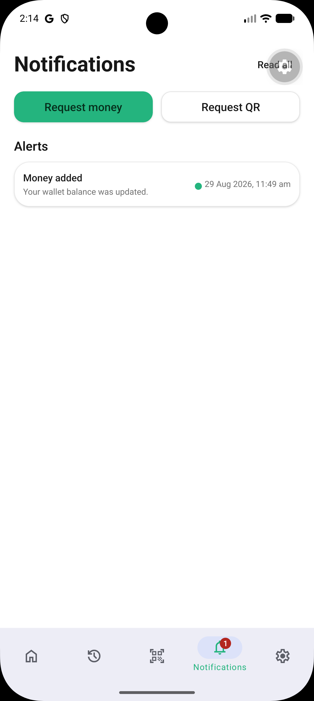
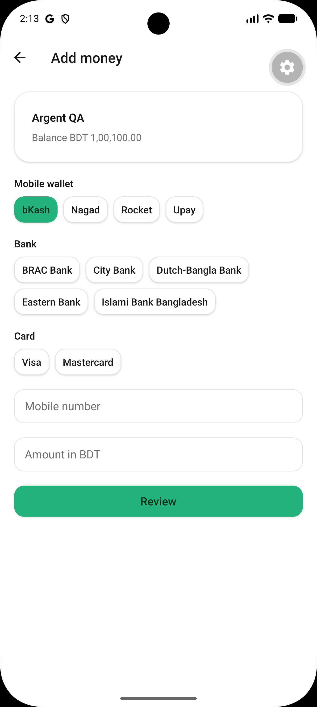
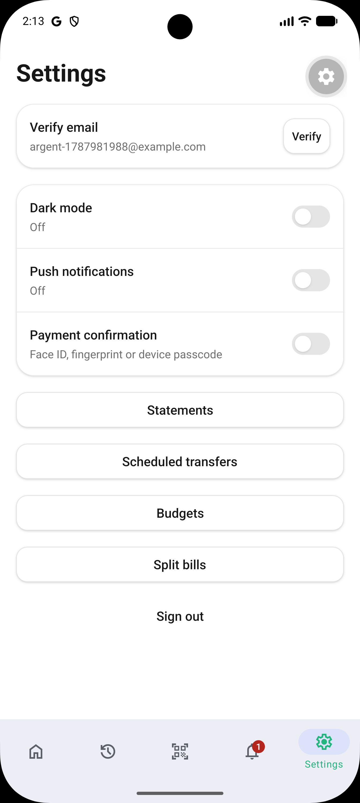
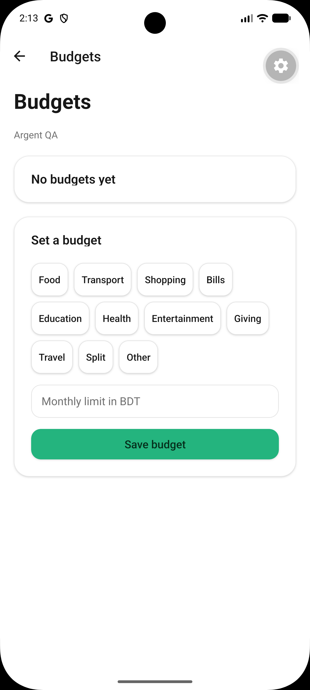
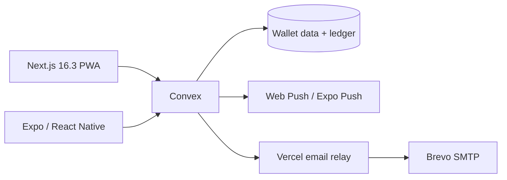

# SheshHisab

SheshHisab is a fast, closed-loop BDT wallet for people and organizations. One Convex backend powers a responsive Next.js PWA and an Expo Android app, so balances, requests, receipts, and notifications stay live across both clients.

[Open the web app](https://sheshhisab.vercel.app) · [Download Android APK](https://github.com/Seyamalam/pstu_final/releases/download/v1.0.0/SheshHisab-v1.0.0.apk) · [View the release](https://github.com/Seyamalam/pstu_final/releases/tag/v1.0.0)

## What it does

- Send and request BDT by handle, QR code, or payment link.
- Keep personal and organization wallets with owner, admin, treasurer, and viewer roles.
- Simulate add-money and withdrawal flows for bKash, Nagad, Rocket, Upay, Bangladeshi banks, Visa, and Mastercard.
- Create receipts, PDF statements, budgets, scheduled transfers, favorites, and split bills.
- Receive an in-app notification inbox plus Web Push and Android push notifications.
- Protect sensitive native actions with device biometrics.
- Install the web client as a PWA or use the signed Android APK.

All wallet balances and external rails are simulated in accordance with the challenge brief; no real payment network is contacted.

## Product gallery

| Web landing | Web account creation |
| --- | --- |
|  |  |
| Password recovery | Native home |
|  |  |
| Native notifications | Add money |
|  |  |
| Settings | Budgets |
|  |  |

## Architecture at a glance



The clients own presentation and device capabilities. Convex owns authentication-linked authorization, integer-poisha money rules, idempotency, atomic balance and ledger writes, notification fan-out, and indexed real-time reads. See the full [architecture document](architecture.md).

## Repository

```text
sheshhisab/   Next.js web/PWA and Convex backend
mobile/       Expo Router Android/iOS client
docs/         plans, release notes, and screenshot evidence
```

## Run locally

Web and Convex:

```bash
cd sheshhisab
bun install
bunx convex dev
bun dev
```

Expo app:

```bash
cd mobile
bun install
bun run android
```

Environment details and credential boundaries are documented in the client setup guides. Secrets, private Firebase Admin keys, and local Argent credentials are not committed.

## Verification

```bash
cd sheshhisab && bun run lint && bun run typecheck && bun run test && bun run build
cd ../mobile && bun run typecheck && bun run test && bunx expo-doctor
```

The Android artifact is built and signed locally; this repository does not use GitHub Actions.

## Documentation

- [Feature matrix](FEATURES.md)
- [Architecture and diagrams](architecture.md)
- [Project plan](docs/PROJECT_PLAN.md)
- [Release checklist](docs/TODO.md)
- [Release notes](docs/RELEASE_NOTES.md)
- [Screenshot inventory](docs/screenshots/README.md)
- [Web setup](sheshhisab/README.md)
- [Expo setup and local Android build](mobile/README.md)
- [Challenge brief](challenge.md)
- [National Hackathon rules](National_Hackathon.md)

## Production

- Web: [sheshhisab.vercel.app](https://sheshhisab.vercel.app)
- Convex production: `lovely-dolphin-835`
- Convex development: `stoic-akita-240`
- Source: [github.com/Seyamalam/pstu_final](https://github.com/Seyamalam/pstu_final)
