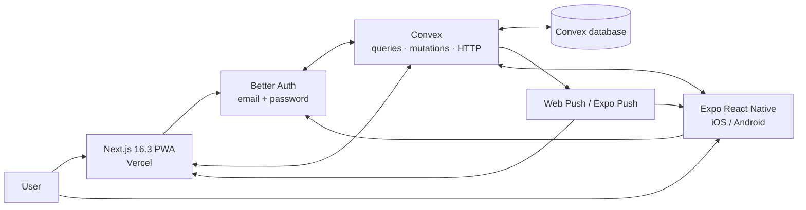
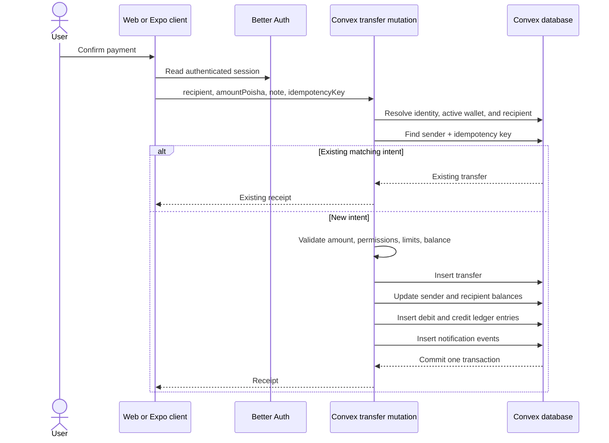
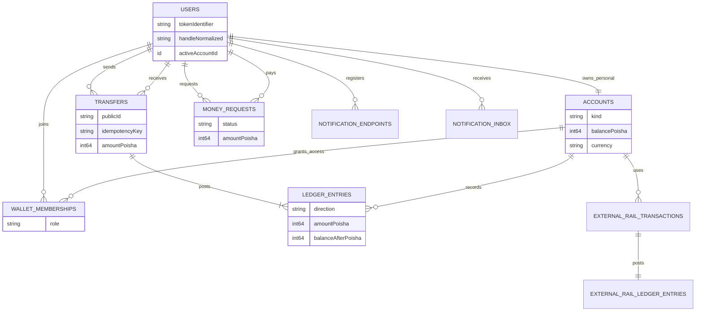
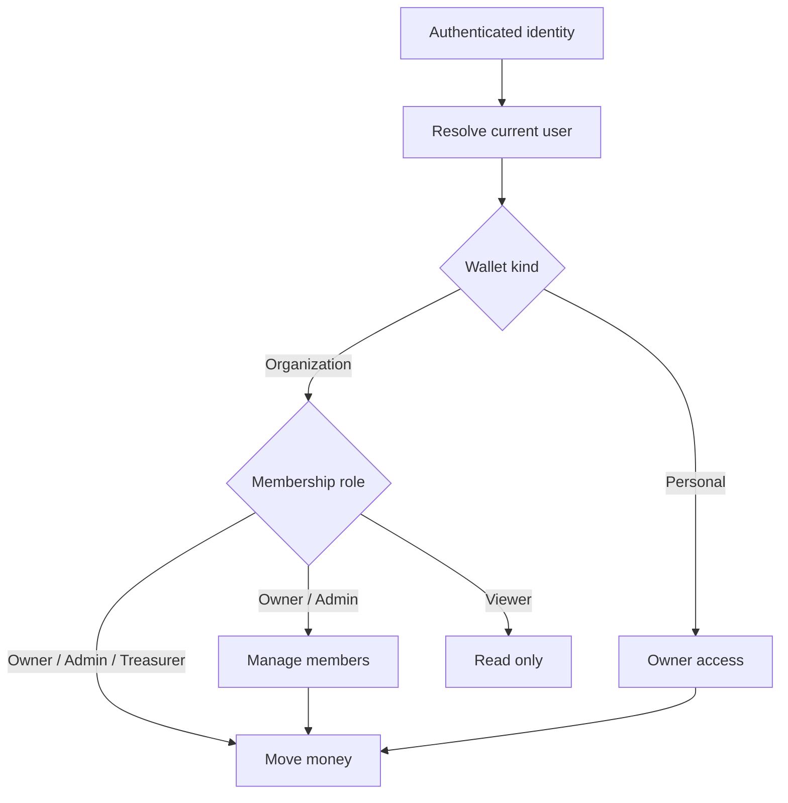
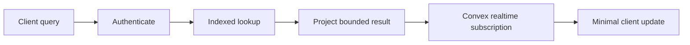
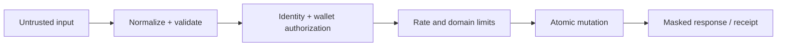
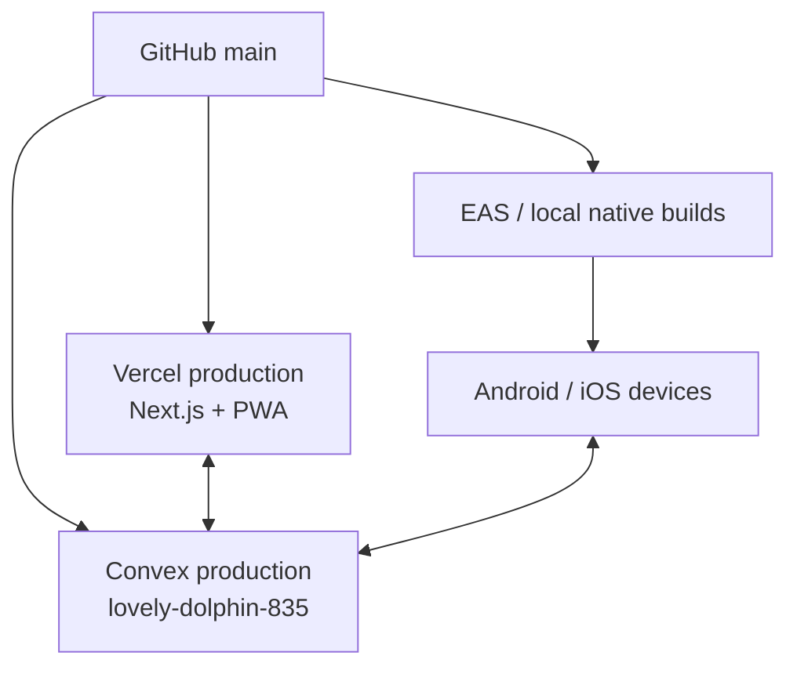

# SheshHisab architecture

## Why this architecture

SheshHisab uses two thin clients over one transactional backend. The web app, native app, auth integration, and wallet domain stay in a single repository, while Convex owns persistence, authorization-sensitive business rules, real-time queries, and atomic mutations. This keeps the system small enough to explain and change quickly without weakening the money-movement invariants.



## Repository layout

```text
pstu_final/
├── sheshhisab/              Next.js web/PWA
│   ├── src/app/             routes, manifest, loading boundaries
│   ├── src/components/      product UI and motion primitives
│   ├── src/lib/             auth, PWA, formatting, validation helpers
│   ├── convex/              schema and backend functions
│   └── public/              service worker and static assets
├── mobile/                  Expo application
│   ├── app/                 Expo Router routes
│   ├── components/          PanelUI application components
│   ├── lib/                 auth, biometric, QR, rail, PDF helpers
│   └── tests/               native domain and routing tests
├── challenge.md             challenge brief
└── National_Hackathon.md    event rules
```

## Client responsibilities

The clients own presentation, input affordances, local loading state, and platform capabilities. They do not decide whether money may move.

- Next.js renders the landing page, auth UI, responsive wallet shell, PWA installation, Web Push controls, camera QR scanning, analytics, and print views.
- Expo renders native tabs, native camera scanning, biometric confirmation, simulated external rails, organization management, and PDF sharing.
- Both clients generate an idempotency key for a stable user intent and submit normalized-looking input to Convex. The backend normalizes and validates it again.

## Backend responsibilities

Convex is the domain boundary:

- maps the Better Auth identity to a SheshHisab user;
- authorizes every query and mutation;
- stores money as signed 64-bit integer poisha;
- applies wallet-role permissions;
- validates balances, limits, state transitions, and idempotency;
- commits balances, transfer records, ledger entries, and inbox events atomically;
- serves indexed real-time queries to both clients;
- stores and revokes notification endpoints.

## Transfer write path



Convex mutations are transactional. If validation fails or a write throws, the mutation commits none of its writes. Concurrent writes that touch the same account are resolved against current database state, so the committed balance and its ledger entry remain consistent.

## Core data model



## Authorization model



Client-side disabled buttons improve usability, but the Convex function repeats the permission check. A forged request therefore cannot bypass wallet membership, ownership, or role rules.

## Reliability invariants

1. Amounts are positive integer poisha and never JavaScript floating-point currency values.
2. A transfer has exactly one debit and one matching credit ledger entry.
3. The sender balance cannot become negative.
4. A sender/idempotency-key pair identifies one intent; reusing it with different details is rejected.
5. A money request follows an explicit pending → paid, declined, or cancelled transition.
6. External rails produce their own immutable transaction and ledger records.
7. Raw MFS, bank, and card references are not stored; only a masked value and keyed fingerprint are persisted.
8. Receipt lookup returns data only to an authorized transfer participant.

## Read path and scaling



- Activity uses sender/recipient plus creation-time indexes and pagination.
- Handle search uses the normalized-handle index and bounded results.
- Receipts use a public-ID index plus participant authorization.
- Memberships and organization roles use compound indexes.
- Rail history and ledger reads are scoped by account and creation time.
- Limits prevent unbounded lists and oversized organization membership sets.

Ten million users do not require ten million records to be scanned; the hot paths begin from an authenticated user, handle, public ID, account ID, or compound index.

## Performance design

### Web

- Next.js 16.3 App Router with Cache Components and partial prefetching
- Server layout resolves the auth token before authenticated Convex queries start
- Route-level loading boundaries keep navigation responsive
- React Compiler reduces unnecessary component work
- Client code is split by route; links use Next.js prefetch behavior
- PWA service worker caches the application shell and static assets
- Native View Transition styling is short and disabled for reduced motion

### Native

- Expo Router route splitting and native tabs
- PanelUI imported through component subpaths to avoid Metro loading the full library export graph
- PanelUI loaders and input animation run on the UI thread and respect reduced-motion settings
- Convex queries begin concurrently and stream updates instead of polling
- Lists use `FlatList` with bounded pages
- Safe-area handling is centralized in shared layout components

## Security boundaries



- Better Auth manages email/password sessions; secrets are not stored in application tables.
- Redirect targets and native notification routes are allowlisted.
- Security headers deny framing, prevent MIME sniffing, constrain referrers, and limit browser permissions.
- Push subscriptions are user-scoped and revocable.
- Rail references are HMAC-SHA-256 fingerprinted using a server-side pepper.
- Sensitive decisions live in Convex functions, not UI state.

## Deployment topology



The deployed web app is [sheshhisab.vercel.app](https://sheshhisab.vercel.app). Web and native environments point to the same production Convex deployment so a payment made on one client appears on the other in real time.

## Testing strategy

- Convex tests cover money validation, transfer idempotency, concurrency-sensitive balance behavior, request transitions, QR handling, rail limits, membership authorization, receipts, and notifications.
- Web tests cover client-side parsing, redirects, PWA capability decisions, notification routing, and UI helpers.
- Native tests cover biometric decisions, intent reuse, QR parsing, rail normalization, PDF escaping, notification deep links, and wallet routes.
- Type checking and production builds run for both clients.
- Native visual QA runs on an Android emulator with screen-by-screen screenshots and safe-area inspection.
